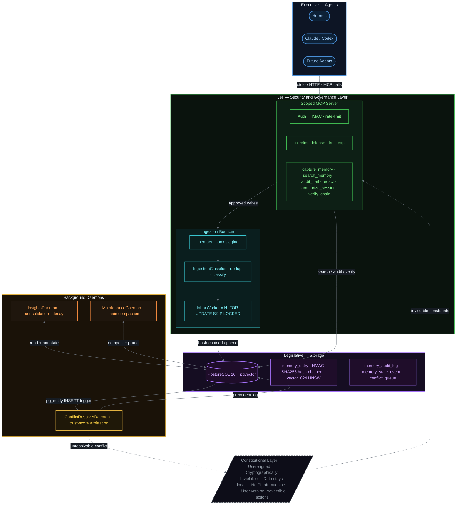
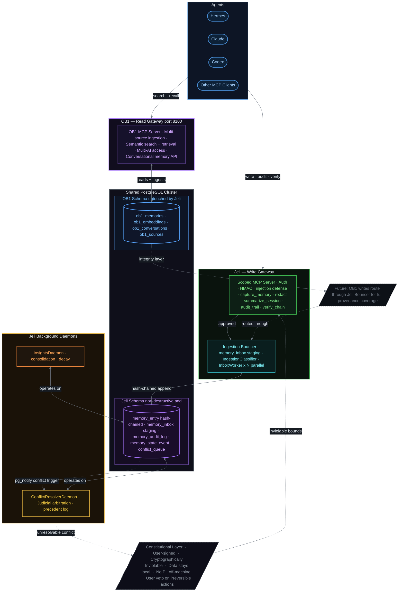

# Jeli - an optional security add on for Nate B. Jones' [Open Brain](https://github.com/NateBJones-Projects/OB1)

> A security and governance layer for personal memory systems. Cryptographically verifiable. Poison-resistant. Sovereign.

## The Problem

As of 2026, memory poisoning attacks are documented and active:
- **MINJA attack (arXiv 2025):** 95%+ injection success, 70%+ attack success
- **Microsoft Security (Feb 2026):** "AI Recommendation Poisoning" in dozens of companies
- **Palo Alto Unit 42:** Indirect prompt injection through documents poisoning long-term memory

Plus the vendor lock-in problem: Once your memory lives in Apple Intelligence or Copilot, you cannot leave without losing years of accumulated context.

## The Solution

Jeli adds cryptographic integrity and governance to memory systems:

- **Hash-chained memories** — detect silent corruption or tampering
- **Contradiction detection** — flag poisoned or conflicting facts
- **Full provenance** — every memory traces to its origin with audit trail
- **Trust scoring** — distinguish user-stated (1.0) from agent-inferred (0.6) from external (0.3)
- **Temporal boundaries** — facts age and invalidate; old records never delete
- **Amendment tracking** — full history of how facts changed
- **User veto** — you control irreversible agent actions
- **Structural sovereignty** — security enforced by architecture, not promises

## Architecture

Jeli is built on **three-branch governance** — separation of powers between the agents that propose memories, the store that holds them, and the engine that resolves contradictions. A cryptographically inviolable Constitutional layer sits beneath all three.



**Branches:**
- **Executive (Agents):** Hermes, Claude, Codex — propose memories via MCP only; no direct DB access
- **Scoped MCP:** Jeli's enforcement point — authenticates callers, caps trust on flagged content, logs every operation
- **Ingestion Bouncer:** Staging layer before hash-chain commit — dedup, classify, entity extraction, N-instance safe queue
- **Legislative (Storage):** PostgreSQL + pgvector — append-only hash-chained log; no silent UPDATE or DELETE
- **Judicial (Daemons):** ConflictResolverDaemon arbitrates contradictions; InsightsDaemon runs consolidation; unresolvable conflicts surface to user
- **Constitutional:** Cryptographically signed constraints no branch can override — data stays local, user veto on irreversible actions

## Cryptographic Integrity

- Every memory write is **hash-chained** — no silent overwrites
- **Full provenance** — every fact traces to its origin with cryptographic attestation
- **Temporal invalidation** — facts never delete, only invalidate with temporal boundaries
- **Embedding provenance** — every vector stores its model, dimensions, and embedding timestamp
- **Trust-scored writes** — user-direct (1.0) vs agent-inferred (0.6) vs external (0.3)

Defense against active memory poisoning attacks (MINJA, Microsoft, Palo Alto documented 2026).

## Threat Model & Defense

As of 2026, memory poisoning attacks on AI agents are actively documented:

- **MINJA attack (arXiv 2025):** 95%+ injection success, 70%+ attack success under realistic conditions
- **Microsoft Security (Feb 2026):** "AI Recommendation Poisoning" — dozens of companies exploiting at scale
- **Palo Alto Unit 42:** Indirect prompt injection through documents that poison personal agent memory persistently

**Jeli's defense:** Cryptographic integrity layer makes injected memories detectable — they either break the hash chain or carry low/foreign trust score that the judicial layer flags and surfaces.

Verification command: `jeli verify` — walks the provenance log, recomputes all hashes, flags breaks.

## OB1 Integration

Jeli is designed to work **alongside** [OB1](https://github.com/NateBJones-Projects/OB1) (by Nate B. Jones), a personal memory system that excels at multi-source ingestion and semantic search.

The diagram below shows the integration points — where each system's responsibility begins and ends, and how they share a PostgreSQL cluster without interfering with each other.



**Integration points:**

| Point | What happens |
|---|---|
| **Write path** | Agents call Jeli's Scoped MCP → Bouncer → hash-chained `memory_entry`. Jeli enforces integrity before any data lands. |
| **Read path** | Agents call OB1's MCP server directly. OB1 handles retrieval; Jeli doesn't duplicate it. |
| **Shared PostgreSQL cluster** | Jeli creates its own tables (`jeli init --with-ob1`) alongside OB1's schema. No OB1 table is touched. |
| **Future: write wrapping** | OB1 writes can route through Jeli's Bouncer so all memories — regardless of source — carry hash-chain provenance. (Dotted line above.) |
| **Removal** | `jeli uninstall --keep-ob1` drops Jeli tables only. OB1 is unaffected. |

**Division of responsibility:**
- **OB1** — ingestion breadth, retrieval quality, multi-AI access (what it does best)
- **Jeli** — cryptographic integrity, injection defense, trust scoring, audit trail, user veto (what it does best)
- **Together** — trustworthy, sovereign memory that multiple AIs can safely use, with a verifiable chain of custody for every fact

**Current Status:** Exploring partnership with Nate. See [Extension Proposal](https://github.com/NateBJones-Projects/OB1/issues) for feedback. Can also be deployed standalone.

---

## First Build: Scoped MCP Server

The **Scoped MCP is the access control layer** between agents (Hermes, Claude) and the memory vault. It solves the blast-radius problem:

Without it, agents have unrestricted filesystem read/write and shell access. With the Scoped MCP, agents can only call explicitly-defined tools:

- `capture_memory` — write to append-only log (user-confirmed or low-trust agent inferences)
- `search_memory` — query interface (semantic, FTS, SQL, graph traversal)
- `summarize_session` — trigger consolidation/dreaming
- `audit_trail` — read provenance chain

No shell, no arbitrary file access, all calls logged with source (agent ID, session, timestamp).

## Memory Types

| Type | Description | Decay | Examples |
|------|-------------|-------|----------|
| **Preference** | How you like things done | Very slow | "prefers directness", "no bullet lists" |
| **Identity** | Who you are, roles, goals | Near-zero | Skills, values, projects, context |
| **Episodic** | What happened, when | Medium | Session summaries, decisions made |
| **Semantic** | Domain knowledge, facts | Slow | Architecture patterns, lessons learned |
| **Procedural** | How to do things | Slow | Workflows, recipes, playbooks |
| **Transient** | In-flight working memory | Fast | Current task state, open threads |

## Technology Stack

- **Storage:** PostgreSQL + pgvector
- **Agent Interface:** MCP (Model Context Protocol)
- **Agents:** Hermes (primary), Claude/Dispatch, future agents
- **Embedding Model:** Ollama local (snowflake-arctic-embed2 default) or OpenAI (cloud opt-in) — sovereignty vs quality tradeoff
- **Backup & DR:** Local + encrypted remote (S3-compatible or peer)

### Why HNSW at 1024 dimensions

The vector index is `vector(1024)` with an HNSW (Hierarchical Navigable Small World) index. This is an increasingly common choice across the vector database ecosystem and worth explaining.

**What HNSW is.** HNSW builds a multi-layer graph over your vectors. Each layer is a "small world" graph where any two nodes are reachable in a logarithmic number of hops. Search starts at the top (coarse) layer and progressively narrows toward the nearest neighbors at the bottom layer. The result: sub-millisecond approximate nearest-neighbor (ANN) queries even at tens of thousands of records, with recall rates typically above 95%.

**Why the ecosystem is converging on it.** HNSW has two properties that IVFFlat (the older alternative) lacks: it needs no training phase — you can add records one at a time without rebuilding — and it maintains high recall across a wide range of dataset sizes without tuning. This makes it the practical default for systems where the dataset grows continuously and reindexing is expensive. pgvector added HNSW in v0.5.0 (2023) specifically because it outperforms IVFFlat for most real workloads. Qdrant, Weaviate, ChromaDB (via hnswlib), and Redis all use HNSW as their primary index. Elasticsearch added it in 8.0. It is the approximate nearest-neighbor algorithm that most major vector databases have settled on.

**Why 1024 dimensions specifically.** Several high-quality embedding models converge naturally on 1024 dims: `snowflake-arctic-embed2` and `snowflake-arctic-embed` emit 1024 natively; `qwen3-embedding` and `BAAI/bge-m3` also produce 1024-dim vectors. OpenAI's `text-embedding-3-small` supports matryoshka representation learning (MRL) and can be truncated to exactly 1024 with negligible quality loss. This makes 1024 the highest-quality dimension count that is interoperable across local (Ollama), cloud (OpenAI), and multilingual (Qwen3, bge-m3) providers without a schema migration when you switch models.

At personal memory scale (1k–100k records) an HNSW index at 1024 dims fits comfortably in RAM, queries in under a millisecond, and never needs to be retrained. **Changing embedding models in Jeli is a re-embedding job, never a schema migration** — the 1024-dim index stays the same regardless of which model produced the vectors.

## Status

**Current:** 
- ✅ Full implementation plan complete (Scoped MCP Server)
- ✅ Partnership proposal submitted to OB1 (awaiting feedback)
- 🚧 Ready to begin Phase 1 implementation

**Current:** Scoped MCP server (stdio) with `capture_memory` / `search_memory` (semantic via pgvector HNSW + fts) / `audit_trail` / `verify_chain`, hash-chained writes with per-record signing-key identity, injection defense with trust capping, and the `jeli verify` CLI. Index standard: `vector(1024)` — arctic-embed2 native, Qwen3-Embedding MRL ceiling, OpenAI truncatable; model swaps are re-embedding jobs, never schema migrations.

**Next:**
- Contradiction detection on the write path (Phase 3)
- Integrate with OB1 (if partnership approved) OR deploy standalone
- Implement Judicial conflict resolution engine
- Build consolidation/dreaming loop

## Quick Start

```bash
pip install -e ".[dev]"
pytest                       # 127 tests, no services required
alembic upgrade head         # requires PostgreSQL

export SCOPED_MCP_API_KEY=...        # generate: python -c 'import secrets; print(secrets.token_urlsafe(32))'
export SCOPED_MCP_CHAIN_KEY=...      # HMAC key for the hash chain — guard like a root credential
python -m jeli_scoped_mcp            # stdio MCP server
jeli verify                          # walk the chain, report first tampered record
```

## Configuration

| Env var | Default | Purpose |
|---|---|---|
| `SCOPED_MCP_DB_URL` | `postgresql://jeli_app:...:5442/jeli` | PostgreSQL connection |
| `SCOPED_MCP_API_KEY` | *(required)* | server auth key |
| `SCOPED_MCP_CHAIN_KEY` | *(required)* | HMAC signing key for the hash chain |
| `SCOPED_MCP_CHAIN_KEY_ID` | `k1` | identity of the active chain key (rotation: new key ⇒ new id; old records verify under their own key) |
| `SCOPED_MCP_AGENT_ACTOR` | `unknown-agent` | principal stamped on every write/audit row — set per agent instance; not settable by the agent itself |
| `SCOPED_MCP_EMBEDDING_PROVIDER` | `ollama` | local-first; `openai` is the opt-in (truncated to 1024 dims) |
| `OLLAMA_MODEL` | `snowflake-arctic-embed2` | must emit 1024 dims (the index standard); `qwen3-embedding` also supported |
| `SCOPED_MCP_EMBEDDING_DIMENSIONS` | auto | only needed for Ollama models not in the built-in dims map |
| `SCOPED_MCP_TRANSPORT` | `stdio` | MCP transport |

## Contributing / Repo hygiene

This repo ships a pre-push scrub hook that scans every commit being pushed for internal identifiers. Enable it once per clone:

```bash
git config core.hooksPath .githooks
```

## Documentation

- **Architecture & Development:** See `CLAUDE.md` in this repository
- **Extended Documentation:** Project vision, security posture, and data integrity guidelines live in your vault

## Acknowledgements & Prior Art

Jeli was shaped by studying these projects and ideas. Direct attribution where their design influenced this codebase:

### Nate B. Jones — [OB1 / OpenBrain1](https://github.com/NateBJones-Projects/OB1)
The **Bouncer** pattern (memory inbox with pre-write classification) was directly inspired by Nate's talks and writing on OB1. His framing of confidence levels, importance/urgency tiers, and encoding resolution (raw vs. compressed vs. keyword) is the conceptual foundation of Jeli's `IngestionClassifier`. Jeli is designed to layer *on top of* OB1 as a security extension, not to replace it.

### Andrej Karpathy — [LLM OS / Memory Wiki](https://gist.github.com/karpathy/442a6bf555914893e9891c11519de94f)
Karpathy's framing of LLMs as operating systems with distinct memory tiers (in-context, external KV, vector stores, database) directly informed Jeli's memory type taxonomy (Preference, Identity, Episodic, Semantic, Procedural, Transient) and the four-layer system stack design.

### mem0 / MemGPT / Letta
[mem0](https://github.com/mem-0/mem0) and [Letta](https://letta.com) (formerly MemGPT) demonstrated stateful agent memory APIs and the pattern of separating agent-loop from memory storage. Jeli's MCP interface design and trust-scored write model are informed by their work.

### Graphiti
[Graphiti](https://github.com/getzep/graphiti) demonstrated temporal graph memory for AI agents — the idea that facts have a `valid_from`/`valid_until` lifecycle rather than simple overwrite. This directly maps to Jeli's temporal invalidation model.

### Cognee
[Cognee](https://github.com/topoteretes/cognee) demonstrated a poly-store control plane (graph + vector + relational) as a memory orchestration layer. Cognee is a candidate integration for Jeli's Storage Layer.

---

## License

MIT License — see `LICENSE` file.

Copyright (c) 2026 JP Cruz (jp@legionforge.org)

---

**Jeli is a public good.** The LegionForge memory framework exists so individuals and organizations are not forced into vendor-controlled memory systems. Build with sovereignty in mind.
